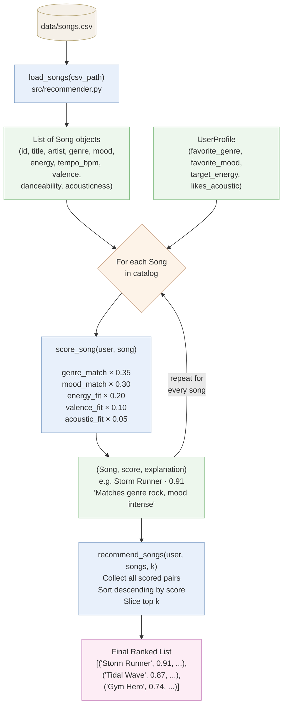

# 🎵 Music Recommender Simulation

## Project Summary

In this project you will build and explain a small music recommender system.

Your goal is to:

- Represent songs and a user "taste profile" as data
- Design a scoring rule that turns that data into recommendations
- Evaluate what your system gets right and wrong
- Reflect on how this mirrors real world AI recommenders

Replace this paragraph with your own summary of what your version does.

---

## How The System Works

Real-world recommenders like Spotify combine two strategies: collaborative filtering, which finds users with similar listening habits and borrows their taste, and content-based filtering, which analyzes the actual attributes of a song, its energy, mood, tempo, and genre, to find tracks that match what a user already enjoys. At scale, these systems process billions of signals (skips, saves, repeat plays) and use neural networks to surface personalized results. Our simulation focuses on the content-based side: we represent each song as a structured set of audio features and each user as a taste profile, then compute a weighted similarity score to rank songs. Rather than learning from behavior over time, our version prioritizes transparency, i.e every recommendation comes with a plain-language explanation of exactly why that song was chosen.

### Song Features

Each `Song` object captures the following attributes from `data/songs.csv`:

| Feature | Type | Description |
|---|---|---|
| `id` | int | Unique identifier |
| `title` | str | Song title |
| `artist` | str | Artist name |
| `genre` | str | Broad category (e.g. lofi, pop, rock, ambient, jazz, synthwave, indie pop) |
| `mood` | str | Emotional tone (e.g. happy, chill, intense, focused, relaxed, moody) |
| `energy` | float (0–1) | Intensity and activity level — low for ambient, high for gym tracks |
| `tempo_bpm` | float | Beats per minute — speed of the track |
| `valence` | float (0–1) | Musical positivity — high = cheerful, low = melancholic or tense |
| `danceability` | float (0–1) | How suitable the track is for dancing based on rhythm and beat strength |
| `acousticness` | float (0–1) | Likelihood the track is acoustic rather than electronic or produced |

### UserProfile Features

Each `UserProfile` stores the user's listening preferences used for scoring:

| Field | Type | Description |
|---|---|---|
| `favorite_genre` | str | The genre the user most wants to hear |
| `favorite_mood` | str | The mood the user is in or prefers |
| `target_energy` | float (0–1) | The energy level that fits the user's current context (e.g. 0.9 for a workout, 0.3 for studying) |
| `likes_acoustic` | bool | Whether the user prefers acoustic/organic textures over electronic production |

### How Scoring Works

For each song, the recommender computes a score using weighted feature matching:

```
score = genre_match  × 0.35   (exact match)
      + mood_match   × 0.30   (exact match)
      + energy_fit   × 0.20   (1 - |target_energy - song.energy|)
      + valence_fit  × 0.10   (inferred from mood preference)
      + acoustic_fit × 0.05   (boost if likes_acoustic and acousticness > 0.6)
```

Songs are then ranked by score and the top `k` are returned, each paired with a human-readable explanation of which features drove the match.

### Pipeline Diagram

The flowchart below traces how a single song travels from the CSV file to a position in the final ranked list:



### Sample Output

Terminal output for a `pop / happy` user profile (energy 0.78):


### Known Biases in This Design

The weight distribution and exact-match logic introduce several predictable failure modes:

- **Genre over-prioritization.** Genre carries 35% of the score as a binary match — a perfect-mood, perfect-energy song in a neighboring genre (e.g. `indie rock` when the user wants `rock`) scores no higher than a completely mismatched song that happens to share the genre label. Great songs get buried purely because of a categorical boundary.

- **Mood label brittleness.** Mood is also a 30% binary match. `melancholic` and `dark` are emotionally close, but the system treats them as completely different, same as `melancholic` vs. `energetic`. Two users in a similar emotional state get different results if they use different words.

- **Genre and mood dominate together.** When both match, a song already has 65% of its maximum score before any audio features are considered. A song with the right genre and mood but wrong energy will almost always outrank a song with perfect energy but a different genre — even if the latter would actually feel like a better fit.

- **No diversity enforcement.** The ranking step is a pure sort. If five lofi songs all score similarly, all five appear in the top-k. A real system would re-rank for variety to avoid repetitive results.

- **UserProfile has no valence field.** Valence (positivity/sadness) is inferred indirectly from mood, which means two users with the same `favorite_mood` but different emotional nuances (one wants melancholic, one wants bittersweet) receive identical valence scoring.

- **Catalog skew.** The dataset has 5 lofi/ambient/folk songs clustered at low energy and only 3 high-energy songs. A user who prefers high-energy genres has fewer meaningful candidates, and the ranking will surface lower-quality matches simply because competition is thinner at that end of the energy axis.

---

## Getting Started

### Setup

1. Create a virtual environment (optional but recommended):

   ```bash
   python -m venv .venv
   source .venv/bin/activate      # Mac or Linux
   .venv\Scripts\activate         # Windows

2. Install dependencies

```bash
pip install -r requirements.txt
```

3. Run the app:

```bash
python -m src.main
```

### Running Tests

Run the starter tests with:

```bash
pytest
```

You can add more tests in `tests/test_recommender.py`.

---

## Experiments You Tried

Use this section to document the experiments you ran. For example:

- What happened when you changed the weight on genre from 2.0 to 0.5
- What happened when you added tempo or valence to the score
- How did your system behave for different types of users

---

## Limitations and Risks

Summarize some limitations of your recommender.

Examples:

- It only works on a tiny catalog
- It does not understand lyrics or language
- It might over favor one genre or mood

You will go deeper on this in your model card.

---

## Reflection

Read and complete `model_card.md`:

[**Model Card**](model_card.md)

Write 1 to 2 paragraphs here about what you learned:

- about how recommenders turn data into predictions
- about where bias or unfairness could show up in systems like this


---

## 7. `model_card_template.md`

Combines reflection and model card framing from the Module 3 guidance. :contentReference[oaicite:2]{index=2}  

```markdown
# 🎧 Model Card - Music Recommender Simulation

## 1. Model Name

Give your recommender a name, for example:

> VibeFinder 1.0

---

## 2. Intended Use

- What is this system trying to do
- Who is it for

Example:

> This model suggests 3 to 5 songs from a small catalog based on a user's preferred genre, mood, and energy level. It is for classroom exploration only, not for real users.

---

## 3. How It Works (Short Explanation)

Describe your scoring logic in plain language.

- What features of each song does it consider
- What information about the user does it use
- How does it turn those into a number

Try to avoid code in this section, treat it like an explanation to a non programmer.

---

## 4. Data

Describe your dataset.

- How many songs are in `data/songs.csv`
- Did you add or remove any songs
- What kinds of genres or moods are represented
- Whose taste does this data mostly reflect

---

## 5. Strengths

Where does your recommender work well

You can think about:
- Situations where the top results "felt right"
- Particular user profiles it served well
- Simplicity or transparency benefits

---

## 6. Limitations and Bias

Where does your recommender struggle

Some prompts:
- Does it ignore some genres or moods
- Does it treat all users as if they have the same taste shape
- Is it biased toward high energy or one genre by default
- How could this be unfair if used in a real product

---

## 7. Evaluation

How did you check your system

Examples:
- You tried multiple user profiles and wrote down whether the results matched your expectations
- You compared your simulation to what a real app like Spotify or YouTube tends to recommend
- You wrote tests for your scoring logic

You do not need a numeric metric, but if you used one, explain what it measures.

---

## 8. Future Work

If you had more time, how would you improve this recommender

Examples:

- Add support for multiple users and "group vibe" recommendations
- Balance diversity of songs instead of always picking the closest match
- Use more features, like tempo ranges or lyric themes

---

## 9. Personal Reflection

A few sentences about what you learned:

- What surprised you about how your system behaved
- How did building this change how you think about real music recommenders
- Where do you think human judgment still matters, even if the model seems "smart"

