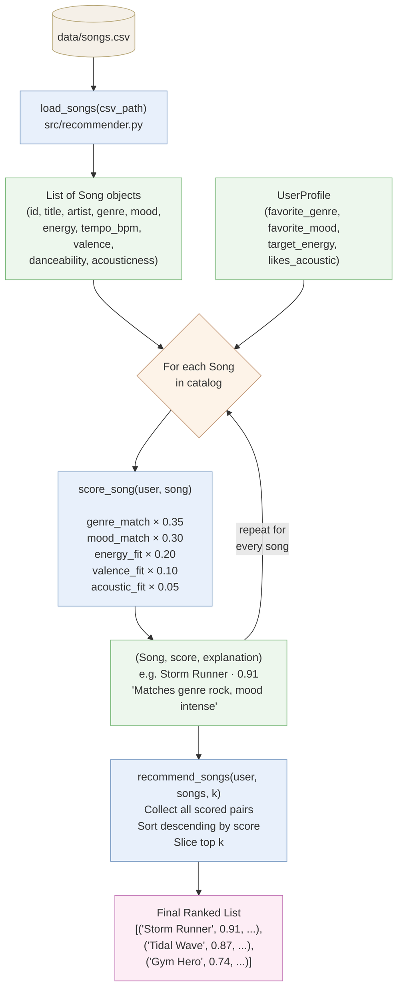
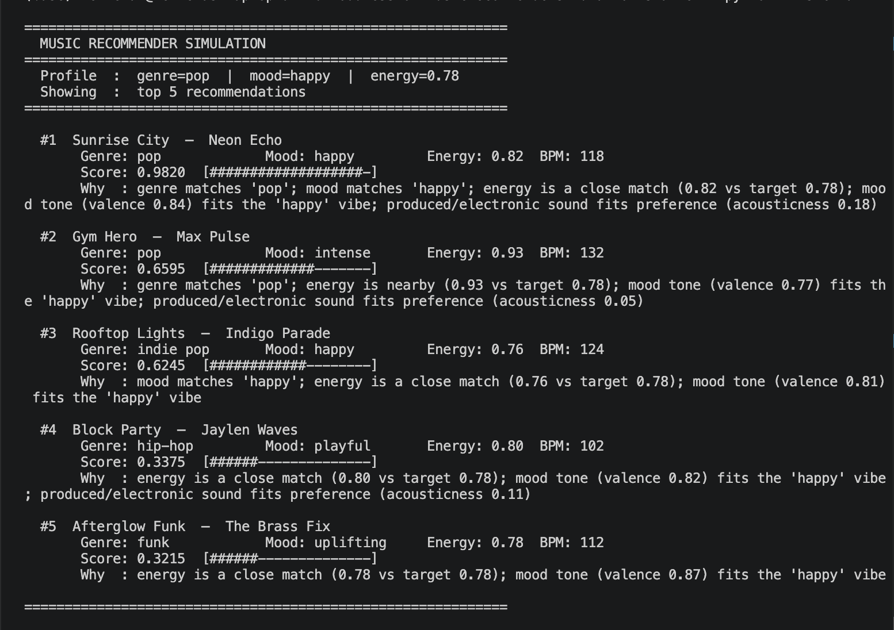
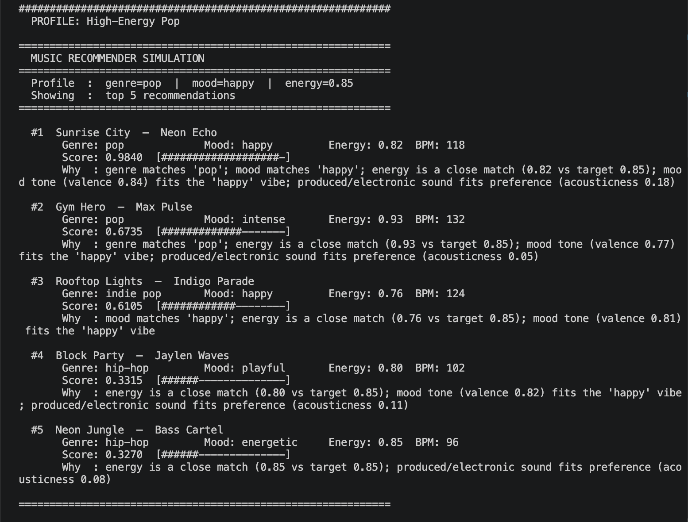
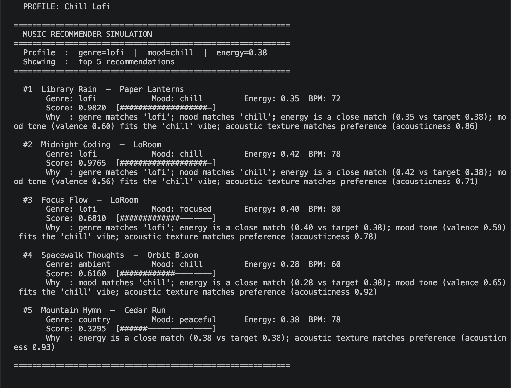
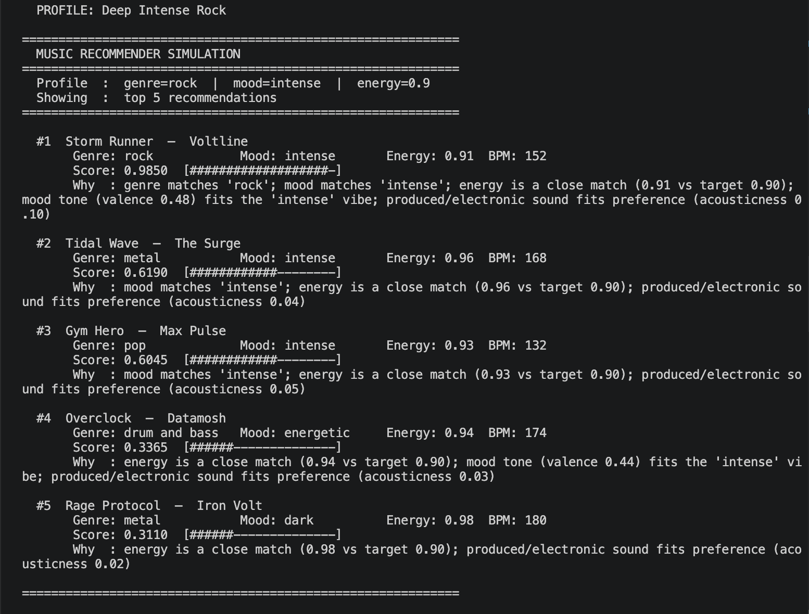
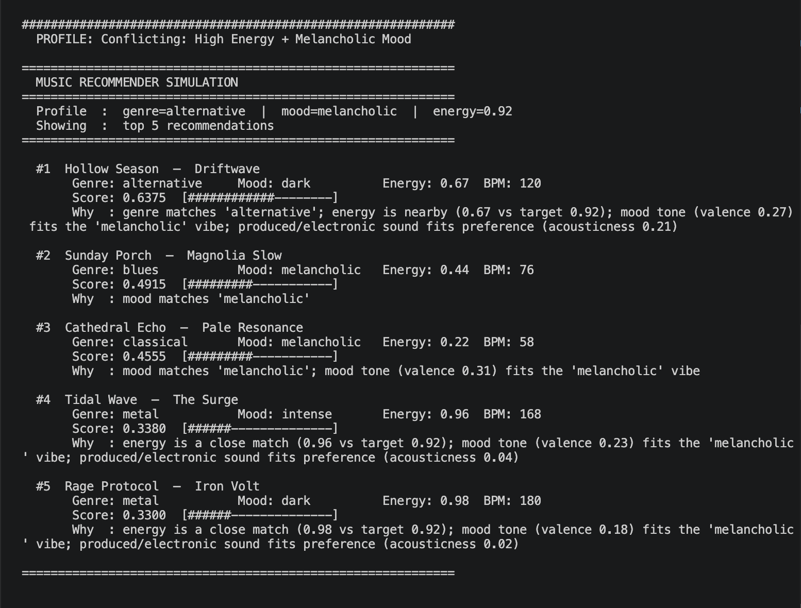
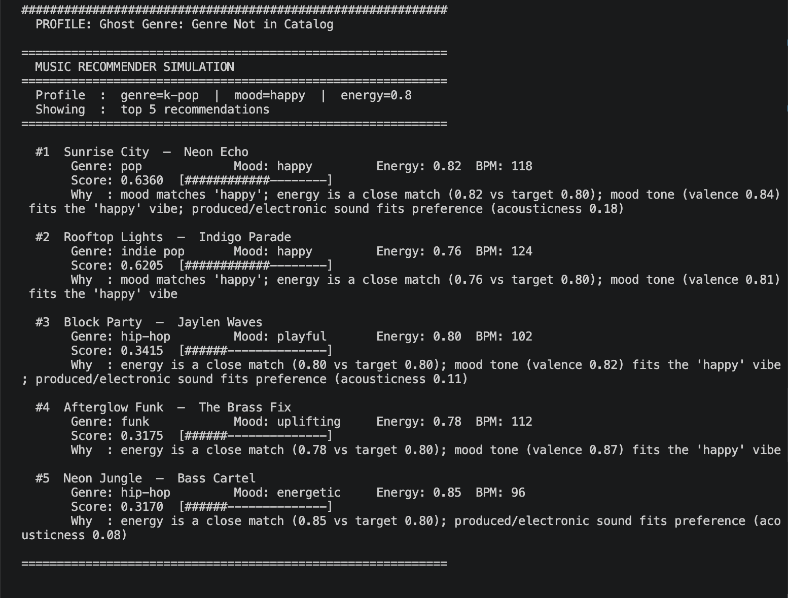
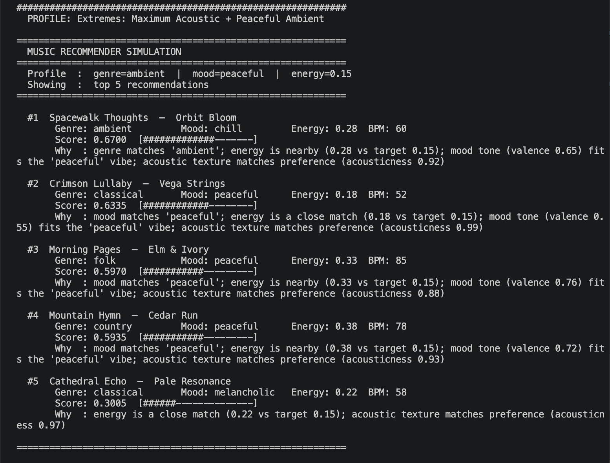
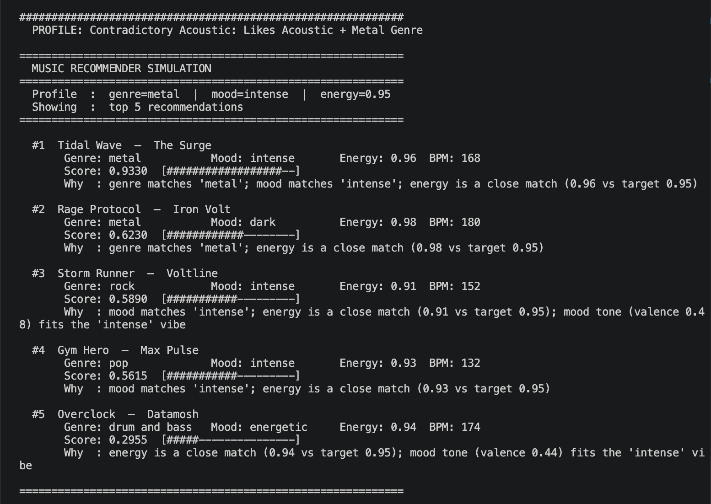

# 🎵 Music Recommender Simulation

## Project Summary

MoodQ is a content-based music recommender built as a classroom simulation. It takes a user's stated preferences (genre, mood, energy level, and acoustic taste) and scores every song in a 28-song catalog against those preferences. Each recommendation comes with a plain-English explanation of why that song ranked where it did. The system does not learn from listening behavior over time. Every result is fully explainable and deterministic.

---

## How The System Works

Real-world recommenders like Spotify combine two strategies: collaborative filtering, which finds users with similar listening habits and borrows their taste, and content-based filtering, which analyzes the actual attributes of a song (its energy, mood, tempo, and genre) to find tracks that match what a user already enjoys. At scale, these systems process billions of signals (skips, saves, repeat plays) and use neural networks to surface personalized results. Our simulation focuses on the content-based side. We represent each song as a structured set of audio features and each user as a taste profile, then compute a weighted similarity score to rank songs. Rather than learning from behavior over time, our version prioritizes transparency. Every recommendation comes with a plain-language explanation of exactly why that song was chosen.

### Song Features

Each `Song` object captures the following attributes from `data/songs.csv`:

| Feature | Type | Description |
|---|---|---|
| `id` | int | Unique identifier |
| `title` | str | Song title |
| `artist` | str | Artist name |
| `genre` | str | Broad category (e.g. lofi, pop, rock, ambient, jazz, synthwave, indie pop) |
| `mood` | str | Emotional tone (e.g. happy, chill, intense, focused, relaxed, moody) |
| `energy` | float (0–1) | Intensity and activity level, low for ambient, high for gym tracks |
| `tempo_bpm` | float | Beats per minute, speed of the track |
| `valence` | float (0–1) | Musical positivity, high = cheerful, low = melancholic or tense |
| `danceability` | float (0–1) | How suitable the track is for dancing based on rhythm and beat strength |
| `acousticness` | float (0–1) | Likelihood the track is acoustic rather than electronic or produced |

### UserProfile Features

Each `UserProfile` stores the user's listening preferences used for scoring:

| Field | Type | Description |
|---|---|---|
| `favorite_genre` | str | The genre the user most wants to hear |
| `favorite_mood` | str | The mood the user is in or prefers |
| `target_energy` | float (0–1) | The energy level that fits the user's current context (e.g. 0.9 for a workout, 0.3 for studying) |
| `likes_acoustic` | bool | Whether the user prefers acoustic/organic textures over electronic production |

### How Scoring Works

For each song, the recommender computes a score using weighted feature matching:

```
score = genre_match  × 0.35   (exact match)
      + mood_match   × 0.30   (exact match)
      + energy_fit   × 0.20   (1 - |target_energy - song.energy|)
      + valence_fit  × 0.10   (inferred from mood preference)
      + acoustic_fit × 0.05   (boost if likes_acoustic and acousticness > 0.6)
```

Songs are then ranked by score and the top `k` are returned, each paired with a human-readable explanation of which features drove the match.

### Pipeline Diagram

The flowchart below traces how a single song travels from the CSV file to a position in the final ranked list:



### Sample Output

Terminal output for a `pop / happy` user profile (energy 0.78):



### Profile Run Results

Results for all 7 user profiles, 3 standard and 4 adversarial edge cases.

#### Profile 1: High-Energy Pop



#### Profile 2: Chill Lofi



#### Profile 3: Deep Intense Rock



#### Profile 4: Conflicting Preferences (High Energy + Melancholic Mood)

Genre match (0.35) outweighs energy mismatch. A slow sad song ranks above fast intense ones because the genre label earns a guaranteed bonus that audio features cannot overcome.



#### Profile 5: Ghost Genre (Genre Not in Catalog)

`k-pop` never matches anything. All scores cluster around 0.64 with no dominant winner. The system falls back to mood and energy but produces undifferentiated results with no clear recommendation.



#### Profile 6: Extremes (Maximum Acoustic + Peaceful Ambient)

`mood=peaceful` has no exact catalog match, so the mood weight (0.30) is never awarded to any song. Genre and acousticness carry the results instead, surfacing songs that feel adjacent but not ideal.



#### Profile 7: Contradictory Preferences (Likes Acoustic + Metal Genre)

Metal songs have acousticness of 0.02 to 0.04, so `likes_acoustic=True` silently penalizes every genre match. The top score is 0.933 instead of a potential 0.985, and the system does not flag the contradiction.



### Known Biases in This Design

The weight distribution and exact-match logic introduce several predictable failure modes:

**Genre over-prioritization.** Genre carries 35% of the score as a binary match. A perfect-mood, perfect-energy song in a neighboring genre (e.g. `indie rock` when the user wants `rock`) scores no higher than a completely mismatched song that happens to share the genre label. Great songs get buried purely because of a categorical boundary.

**Mood label brittleness.** Mood is also a 30% binary match. `melancholic` and `dark` are emotionally close, but the system treats them as completely different. Two users in a similar emotional state get different results if they use different words.

**Genre and mood dominate together.** When both match, a song already has 65% of its maximum score before any audio features are considered. A song with the right genre and mood but wrong energy will almost always outrank a song with perfect energy but a different genre, even if the latter would actually feel like a better fit.

**No diversity enforcement.** The ranking step is a pure sort. If five lofi songs all score similarly, all five appear in the top-k. A real system would re-rank for variety to avoid repetitive results.

**UserProfile has no valence field.** Valence (positivity/sadness) is inferred indirectly from mood, which means two users with the same `favorite_mood` but different emotional nuances receive identical valence scoring.

**Catalog skew.** The dataset has 5 lofi/ambient/folk songs clustered at low energy and only 3 high-energy songs. A user who prefers high-energy genres has fewer meaningful candidates, and the ranking will surface lower-quality matches simply because competition is thinner at that end of the energy axis.

---

## Getting Started

### Setup

1. Create a virtual environment (optional but recommended):

   ```bash
   python -m venv .venv
   source .venv/bin/activate      # Mac or Linux
   .venv\Scripts\activate         # Windows

2. Install dependencies

```bash
pip install -r requirements.txt
```

3. Run the app:

```bash
python -m src.main
```

### Running Tests

Run the starter tests with:

```bash
pytest
```

You can add more tests in `tests/test_recommender.py`.

---

## Experiments

We ran two main experiments during development.

**Weight shift:** We doubled the energy weight from 0.20 to 0.40 and halved the genre weight from 0.35 to 0.175, keeping the total at 1.0. For the High-Energy Pop profile, Rooftop Lights (indie pop) jumped above Gym Hero (pop) because its energy was a closer match. A cross-genre song beat an in-genre song purely based on how the music sounds. This confirmed that the default weights embed a strong editorial opinion: genre matters almost twice as much as audio feel.

**Adversarial profiles:** We tested four edge cases specifically designed to expose weaknesses: conflicting preferences, a ghost genre, extreme values, and contradictory acoustic taste. Every one revealed a different failure mode. The most surprising was the ghost genre result. When a genre does not exist in the catalog, all scores collapse into a narrow band with no meaningful winner. The system returns five results that all look equally mediocre, with no way to signal that it is operating outside its intended range.

---

## Limitations and Risks

MoodQ only works within a 28-song catalog, so any genre or mood not represented will receive no direct match. The system does not understand lyrics, language, cultural context, or listening history. It cannot detect when a user's preferences contradict each other (e.g. acoustic taste combined with metal genre) and will silently penalize results without explanation. Eleven out of nineteen genres have exactly one song, which means those genres almost always produce a single guaranteed result rather than a genuine ranked list. The system should not be used in any real product context.

---

## Reflection

Building this project made it clear how much invisible design lives inside the weights. Every number in the scoring formula is an editorial decision: genre is worth 35%, mood is worth 30%, and everything about how the song actually sounds is worth the remaining 35%. Those choices feel reasonable until you run the adversarial profiles and see a slow sad song beat a fast intense one because of a genre label. The algorithm is doing exactly what we told it to do. The problem is that what we told it to do does not always match what a real listener would want.

The other thing that surprised us was how quickly simple logic produces results that feel meaningful. Three features (genre, mood, energy) and two labels, added up with fixed weights, are enough to make a recommendation that feels right for most normal users. That is both encouraging and a little unsettling: it means users of real systems might trust recommendations that are built on assumptions just as simple, without knowing it.

For full evaluation details, bias analysis, and future improvement ideas, see the [Model Card](model_card.md).
