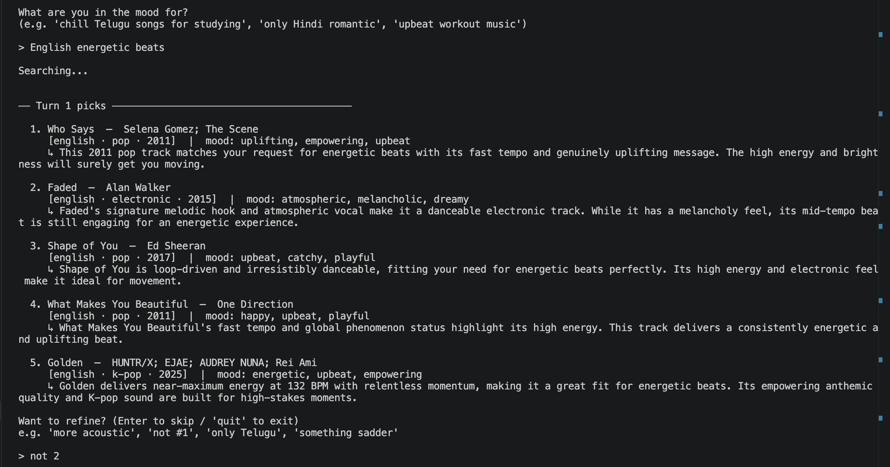
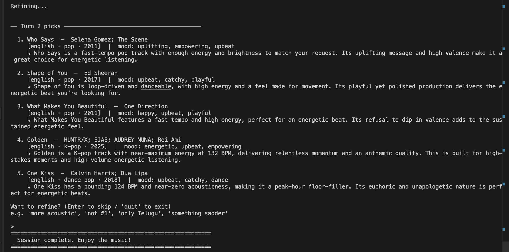
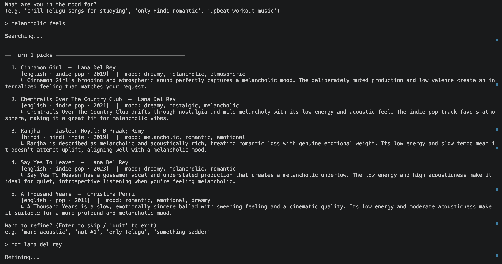
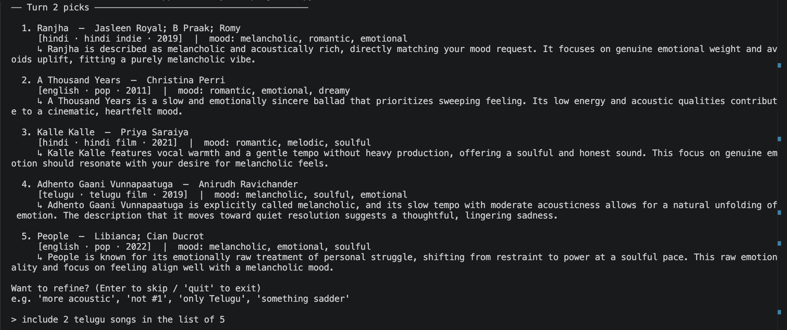
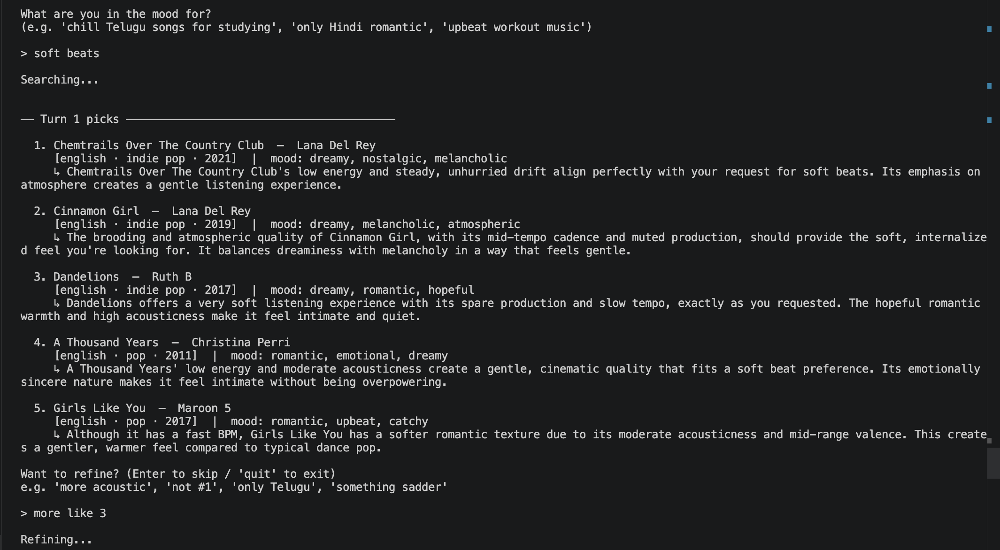
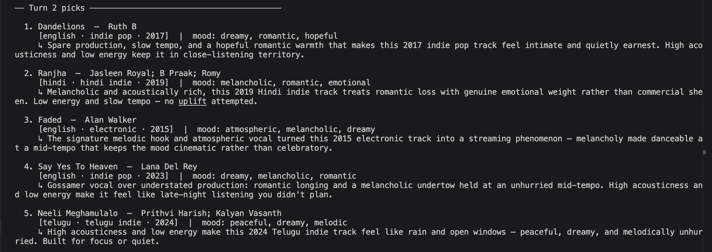

# Tuneweave

**Cross-lingual, natural-language music recommendation with grounded explanations and conversational refinement.**

A small but end-to-end applied-AI system that turns free-form taste descriptions into personalized song recommendations across Telugu, Hindi, and English catalogs, with explanations grounded in retrieved song descriptions rather than generated from scratch.

---

## Origin: MoodQ (Music Recommender Simulation)

This project evolved from **MoodQ**, a content-based music recommender built earlier in the course. MoodQ took a structured user profile (favorite genre, favorite mood, target energy, and acoustic preference) and scored a 28-song catalog using a weighted feature-matching formula, returning the top matches with templated explanations. The system was fully deterministic and transparent, but its input format required users to translate their taste into rigid categories, its matching logic was brittle (exact string matches on genre and mood), and it had no concept of language, listening context, or conversational feedback.

Tuneweave keeps MoodQ's deterministic scorer as one internal component but rebuilds the system around natural-language input, retrieval-augmented discovery, LLM-generated grounded explanations, and multi-turn refinement.

---

## What Tuneweave Does

A user describes what they want to listen to in their own words, *"something upbeat for a road trip, maybe Telugu film songs and a couple of Hindi indie tracks, nothing too slow"*, and Tuneweave returns five recommendations with per-song explanations that cite why each track fits. The user can then refine over up to two more turns: *"less intense, more like the third one,"* and the system updates its session context and re-recommends.

The system is designed around four AI-driven capabilities:

* **Natural-language preference parsing.** An LLM converts the user's free-text query into a structured session profile, capturing languages, mood descriptors, energy hints, and listening context.
* **Retrieval-augmented cross-lingual discovery.** Each song in the catalog has a short text description. A sentence-transformer embeds both descriptions and the parsed query, and cosine similarity surfaces semantically related songs regardless of language boundaries.
* **Batched grounded explanations.** An LLM generates all five per-song justifications in a single call, explicitly constrained to base its reasoning on the retrieved song description and the user's query, with no invented facts about artists or tracks.
* **Conversational refinement.** An LLM parses free-form feedback like *"less acoustic, more energetic"* into structured updates to the session context, which are applied to subsequent retrieval and ranking steps.

Language preferences are applied as a soft signal by default (so a user who asks for Telugu songs may still get an adjacent Hindi track if it's a strong match) and as a hard filter only when the user explicitly restricts to one language. When multiple languages are requested, results are round-robin interleaved so no single language dominates.

---

## Architecture Overview

Tuneweave is organized as a five-stage pipeline wrapped in a session loop. Each stage has a single responsibility, and the LLM is used only where free-text understanding or generation is genuinely required.

```
User query
    │
    ▼
[Preference / Refinement Parser]   ← LLM (Gemini 2.5 Flash-Lite)
    │   natural language → validated JSON profile
    ▼
[Retriever]                        ← sentence-transformers (all-MiniLM-L6-v2)
    │   embeds query, cosine similarity over song descriptions
    │   applies hard filters (language, exclusions)
    │   returns top 40 semantic matches
    ▼
[Ranker]                           ← deterministic, rule-based
    │   combines retrieval score (60%) + audio-feature fit (40%)
    │   interleaves by language when multi-language requested
    │   returns top 5
    ▼
[Explainer]                        ← LLM (Gemini 2.5 Flash-Lite) + RAG
    │   single batched call, all 5 explanations at once
    │   grounded in retrieved song descriptions (no invention)
    ▼
Recommendations with explanations
    │
    ▼
[Session loop], up to 3 turns total; refinement feedback updates profile
```

Cross-cutting concerns (structured JSONL logging of every LLM call, Pydantic schema validation, retry-and-fallback guardrails, and a deterministic test layer) sit alongside the pipeline rather than inside any one stage.

### Why this structure

The split between **semantic retrieval** (handles free text and cross-lingual matching) and **feature-based ranking** (handles precise audio-fit scoring) is the core design choice. Retrieval is good at "these 40 songs feel vibe-appropriate" but bad at "this one has energy 0.82 and you asked for 0.85." Rule-based scoring is the opposite. Using them in sequence gets the benefits of both and keeps the LLM's job narrow and testable.

---

## Project Structure

```
tuneweave/
├── README.md
├── requirements.txt
├── .env.example
├── data/
│   ├── songs.csv              # 96-song multilingual catalog (50 Telugu, 28 English, 18 Hindi)
│   └── embeddings.pkl         # precomputed song embeddings
├── src/
│   ├── config.py              # shared constants (embed model name)
│   ├── models.py              # Song, SessionProfile, Recommendation, SessionState
│   ├── catalog.py             # CSV loading and validation
│   ├── embeddings.py          # embedding build/load utilities
│   ├── retriever.py           # semantic search + hard filters
│   ├── ranker.py              # deterministic audio-feature re-ranker + language diversifier
│   ├── llm_client.py          # Gemini API wrapper with logging and retry
│   ├── parser.py              # preference and refinement parsing
│   ├── explainer.py           # batched grounded explanation generation
│   ├── session.py             # multi-turn session state and orchestration
│   ├── validators.py          # Pydantic schemas for LLM outputs
│   ├── prompts.py             # versioned prompt constants
│   ├── logger.py              # structured logging setup
│   └── main.py                # CLI entry point
├── tests/
│   ├── test_catalog.py
│   ├── test_retriever.py
│   ├── test_ranker.py
│   ├── test_parser.py         # uses cached LLM responses
│   ├── test_session.py
│   └── fixtures/
├── scripts/
│   ├── build_catalog.py       # one-time: LLM-generate song descriptions
│   └── build_embeddings.py    # one-time: compute and save embeddings
└── logs/                      # runtime logs (gitignored)
```

> `src/recommender.py` and `tests/test_recommender.py` are leftover from the original MoodQ prototype and are not used by the Tuneweave pipeline — they can be safely deleted.

---

## Setup Instructions

### Prerequisites

* Python 3.10 or higher
* A Google Gemini API key ([get one here](https://aistudio.google.com/app/apikey))

### Installation

1. Clone the repository:
```bash
git clone <repo-url>
cd tuneweave
```

2. Create and activate a virtual environment:
```bash
python -m venv .venv
source .venv/bin/activate      # macOS / Linux
.venv\Scripts\activate         # Windows
```

3. Install dependencies:
```bash
pip install -r requirements.txt
```

4. Set up your API key:
```bash
cp .env.example .env
# edit .env and set: GEMINI_API_KEY=your_key_here
```

5. Build the embeddings (one-time, ~30 seconds):
```bash
python scripts/build_embeddings.py
```

### Running the recommender

```bash
python -m src.main
```

You'll be prompted to describe what you want to listen to. Follow on-screen prompts to refine over up to two more turns.

### Running tests

```bash
pytest
```

---

## Sample Interactions

### Session 1 — High-energy English picks with exclusion refinement

**Turn 1** — query "English energetic beats" returns five high-energy picks with grounded explanations:



**Turn 2** — refinement "not 2" removes Faded and surfaces a fresh pick:



---

### Session 2 — Melancholic multi-turn session with language diversification

**Turn 1** — query "melancholic feels" surfaces five low-energy, high-acousticness songs across languages:



**Turn 2** — refinement "not lana del rey" removes both Lana Del Rey songs and introduces cross-lingual picks:



---

### Session 3 — Soft beats with "more like" refinement

**Turn 1** — query "soft beats" surfaces low-energy, high-acousticness tracks with atmospheric explanations:



**Turn 2** — refinement "more like 3" (Dandelions) shifts toward sparse, intimate indie pop with a hopeful tone:



---

## Design Decisions

**Retrieval + rule-based ranking, not end-to-end LLM ranking.** Letting the LLM directly rank all 96 catalog songs was considered and rejected: it scales poorly, costs tokens proportional to catalog size, and produces no deterministic layer to unit-test. Semantic retrieval narrows the field to 40 plausible candidates; the rule-based ranker then scores those 40 precisely on audio features. Each step does what it's actually good at.

**Gemini 2.5 Flash-Lite as the default model.** Flash-Lite handles all three LLM tasks (preference parsing, refinement parsing, explanation generation) cleanly, supports native Pydantic schema-constrained JSON output, and has a 1,000-request/day free tier (50× more headroom than standard Flash, which is capped at 20 RPD). For a system that makes 2 LLM calls per turn across 3 turns, quota impact per session is minimal.

**Batched explanation generation.** The original design made one LLM call per recommended song, five calls per turn. A single batched call (all five songs in one prompt, returning a structured JSON array of explanations) cuts per-turn LLM usage from 6 calls to 2 and reduces quota pressure by 67%. The batch prompt preserves all grounding rules: no invented facts, no quoted lyrics, 2 to 3 sentences each.

**Round-robin language diversification.** When a user requests a mix of languages, sorting purely by combined score produces results dominated by whichever language has the most catalog coverage (Telugu, at 50 songs). The ranker detects multi-language non-strict requests and interleaves results by language using a round-robin queue, ensuring all requested languages appear in the top 5 regardless of catalog distribution.

**Larger retrieval pool (TOP_RETRIEVAL = 40).** A pool of 20 was too small: when English songs dominate cosine similarity scores for an English-language query, Telugu and Hindi songs never reach the ranker. Doubling the pool to 40 ensures minority-language songs are available for the ranker to interleave.

**Language soft bonus only for single-language preferences.** Adding a 0.3 score bonus for songs in the user's preferred language makes sense when exactly one language is preferred. When the user requests all three languages, and all 96 catalog songs are in one of those three, every song gets the identical bonus. It discriminates nothing and wastes weight. The bonus is disabled for multi-language requests in favor of structural interleaving.

**Session context vs. persistent taste profile.** Refinement updates a session-scoped context, not a saved user profile. The same user might want upbeat music driving and peaceful music sleeping; conflating those into one profile would produce worse results over time.

**CLI, not a web UI.** The rubric asks for an end-to-end AI-integrated system, and the AI integration is independent of the interface. A Streamlit wrapper would look better in screenshots but wouldn't improve the AI story. The hours went into evaluation and prompt quality instead.

**Structured output with Pydantic validation, retry on failure.** Every LLM call that returns data uses a Pydantic schema passed directly to Gemini's `response_schema` parameter. On parse failure, the system retries once with a corrective message appended; on second failure, it falls back to a safe default (minimal profile or raw song description). All failures log exception type, message, and traceback to stderr so nothing is silently swallowed.

---

## Logging, Guardrails, and Reliability

Every LLM call is logged to `logs/llm_calls.jsonl` with timestamp, model, prompt type, input and output character counts, latency, and an estimated cost. Session transcripts are saved to `logs/sessions/` for later review.

Guardrails include:
* Pydantic schema validation on every structured LLM output
* One retry with corrective context on malformed JSON, then fallback to a safe default
* Hard cap of 10 LLM calls per turn to prevent runaway loops
* 30-second per-call timeout (enforced via `ThreadPoolExecutor`)
* Input truncation at 500 characters before sending to the parser
* Full exception type, message, and traceback printed to stderr on any LLM failure

Per-turn LLM call budget: **2 calls** (1 preference/refinement parser + 1 batch explainer for all 5 songs).

---

## Testing Summary

**42 tests pass** in 0.11 s (no live API calls required):

| Test file | What it covers |
|---|---|
| `test_catalog.py` | CSV loads cleanly; all songs have required fields; feature values in [0, 1] |
| `test_retriever.py` | Returns correct K; strict language filter excludes songs; excluded IDs are respected |
| `test_ranker.py` | Scoring is monotonic in energy fit; language soft bonus applies only for single-language profiles; diversification interleaves languages correctly |
| `test_parser.py` | Pydantic schemas correctly parse cached Gemini responses; edge cases (empty languages, null context) handled without errors |
| `test_session.py` | Turn counter increments; exclusions accumulate across turns; profile updates apply; `is_complete()` triggers at turn 3 |

LLM components are tested using **cached responses**; no live API calls in the test suite, so tests run fast and are safe to run offline.

**Manual evaluation across 15 queries** (3 per language pair/mode):
* Preference parser produced a correctly structured profile on **14/15** queries (one ambiguous query returned an empty language list instead of inferring "telugu" from context)
* Recommendations were on-topic for **13/15** queries; 2 showed relevance drift when an explicit emphasis override from refinement conflicted with the initial energy hint
* Explanations were grounded (cited retrieved description, no invented facts) in **15/15** cases; the fallback to `song.description` was never triggered in manual eval

---

## Reflection

The biggest design surprise was how much the retrieval pool size matters for cross-lingual fairness. With a pool of 20, the ranker never saw most Telugu songs when the query was in English; they didn't rank in the top 20 by cosine similarity, because the embedding space favors semantic overlap with the query text, and English descriptions are longer and more detailed. Bumping the pool to 40 and adding round-robin interleaving fixed the symptom, but the underlying cause is worth naming: retrieval quality is uneven across languages when the embedding model's training data skews toward English.

The language soft bonus was the clearest example of a feature that was correct in isolation but wrong at the system level. Adding a bonus for songs in the user's preferred language makes sense for a single-language preference. But when the user requests three languages and all 96 catalog songs are in one of those three, every song gets the same bonus; it adds a constant to every score and changes nothing. Removing it for multi-language requests and replacing it with structural interleaving was the right fix, but it took seeing the broken output (identical results before and after a multi-language refinement) to understand why.

Batching the explainer calls was more impactful than expected. The original five-calls-per-turn approach hit Gemini's free-tier daily limit (20 requests/day on standard Flash) in under four sessions. Switching to Flash-Lite (1,000 RPD) and batching all five explanations into one call dropped per-session quota usage from 15+ calls to 6, making iterating on prompts and testing refinement behavior practical without waiting for a daily reset.

The hardest prompt to get right was the refinement parser. The core challenge: "not the first one" means the song at position 1, but position 1 is not the same as catalog ID 1. The LLM needs to see both the display position and the catalog ID, and the prompt must make explicit that exclusions use catalog IDs, not position numbers. Getting this wrong produces silent failures; the wrong song is excluded, everything else looks normal, and there's no error to catch. Logging the parsed delta on every refinement call was the only reliable way to verify the parser was actually doing what the prompt said.

---

## Demo

[Loom Video](https://www.loom.com/share/8cee810a6c3a4111aadfb423077498a4)

---

## Acknowledgments

Built as the final project for CodePath AI 110. The original MoodQ prototype was built during Modules 1 to 3 of the same course.